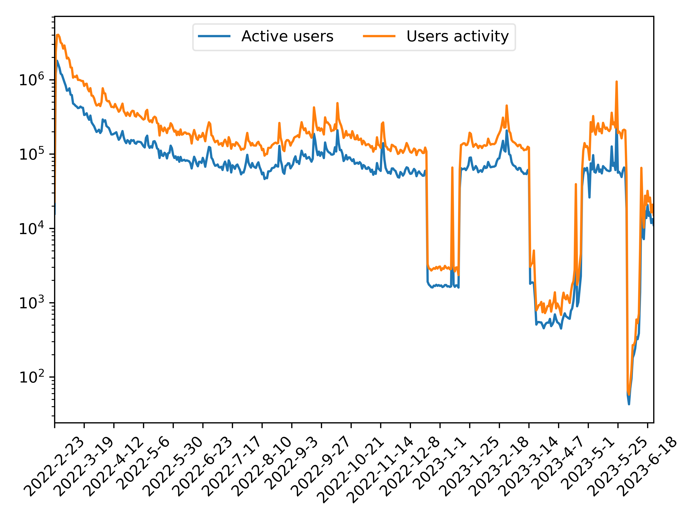
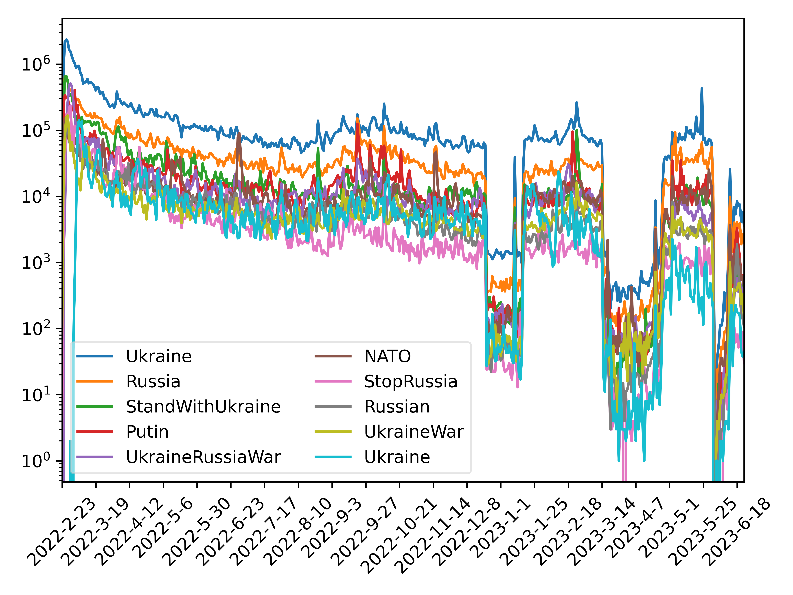
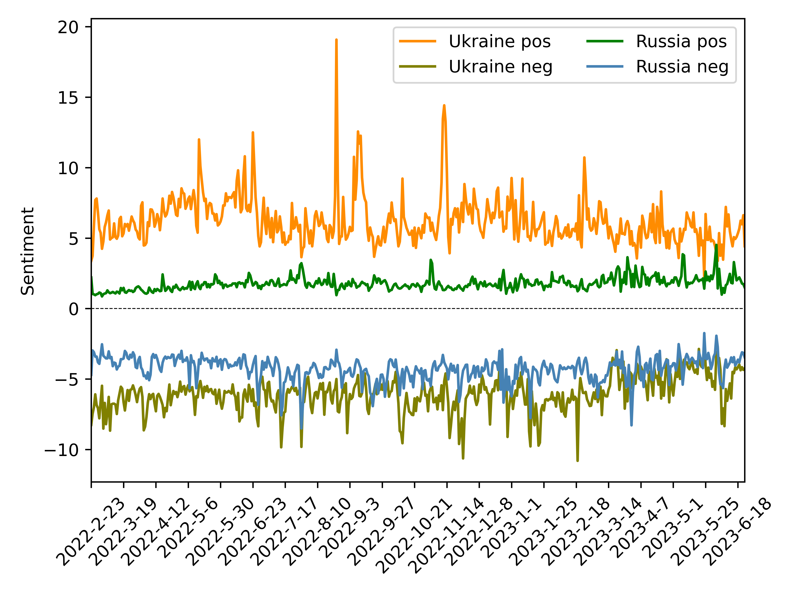
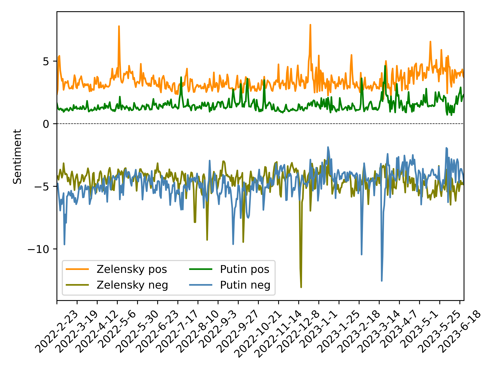

# Russo Ukrainian War Collection of Tweet IDs
 
The repository contains collection of tweets IDs associated with the current war between Russia and Ukraine, which we commenced collecting on Februrary 24, 2022. We leveraged Twitter's search API to 
extract historical tweets, leading our dataset to contain tweets from February 22, 2022. We utilize Twitter’s streaming API to collect dataset based on selected popular hashtags corelated to particullar topic.
The list of selected hashtags is presented in "hashtags.txt" file ([hashtags.txt](hashtags.txt)). To comply with Twitter’s [Terms of Service](https://developer.twitter.com/en/developer-terms/agreement-and-policy), we are only publicly releasing the Tweet IDs of the collected Tweets. The data is released for non-commercial research use. 

The associated paper is accepted into 16th International Conference on Advances in Social Networks Analysis and Mining (ASONAM-2024) with title: [Exploring Crisis-Driven Social Media Patterns: A
Twitter Dataset of Usage During the
Russo-Ukrainian War](TBD)

## Data Organization
The Tweet-IDs are organized as follows:
* Tweet-ID files are stored in folders that indicate the year and month of the collection (YEAR-MONTH). 
* Individual Tweet-ID files contain a collection of Tweet IDs, and the file names all follow the same structure, with a prefix “tweet_ids_day_” followed by the YEAR_MONTH_DATE. 
* Note that Twitter returns Tweets in UTC, and thus all Tweet ID folders and file names are all in UTC as well. 

## Data Statistics and Analysis
We are manage to perform multiple statistical measurments in daily basis over the described dataset such as:
* User Activity/ Traffic volume ([daily_stats.csv](analysis_data%2Fdaily_stats.csv))
* Active users ([daily_stats.csv](analysis_data%2Fdaily_stats.csv))
* Volume of suspended and deactivated accounts ([index_stats.txt](analysis_data%2Findex_stats.txt))
* Traffic volume based on text language ([daily_lang.csv](analysis_data%2Fdaily_lang.csv))
* Traffic of hashtags ([daily_hashtags.csv](analysis_data%2Fdaily_hashtags.csv))
* Sentiment analysis between entities of Russia and Ukraine ([daily_sentiment.csv](analysis_data%2Fdaily_sentiment.csv))
* Sentiment analysis between entities of Putin and Zelensky ([daily_sentiment.csv](analysis_data%2Fdaily_sentiment.csv))

All described analytics are published in [Parasecurity Group webpage](https://russoukrainianwar.parasecurity.edu.gr).

## Anonymized Text Data Sharing
Additionally, we have shared the collected text data sorted by creation date. User IDs, tweet IDs, and user mentions have all been anonymized for privacy. You can access the data via the following link: [Zenodo repository](https://zenodo.org/records/8431047).

# Statistics Summary (v1.0)
Number of Tweets : **127,275,386**

### Daily volume of registered users activity

### Daily volume of 10 most popular hashtags

### Daily positive and negative sentiments towards each country

### Daily positive and negative sentiments towards each president

# Data Usage Agreement / How to Cite
By using this dataset, you agree to abide by the stipulations in the license, remain in compliance with Twitter’s [Terms of Service](https://developer.twitter.com/en/developer-terms/agreement-and-policy), and cite the following manuscript: 

Authors and Paper title with arxiv_id
BibTeX:
TBD

# Inquiries

Please read through the README and the closed issues to see if your question has already been addressed first. 

If you have any  questions about this dataset/analysis, please contact : 
* Ioannis Lamprou at **ilamprou1[at]tuc.gr**
* Alexander Shevtsov at **asevtsov[at]tuc.gr**.

